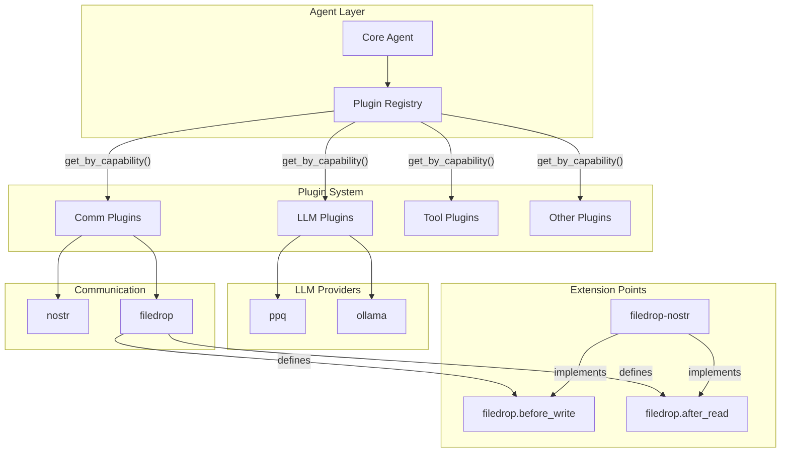
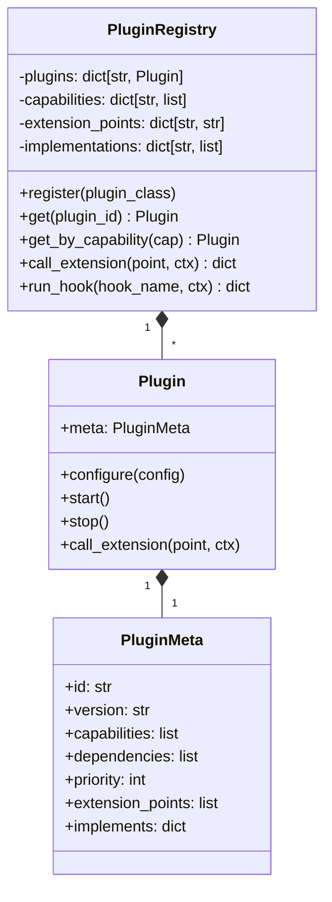
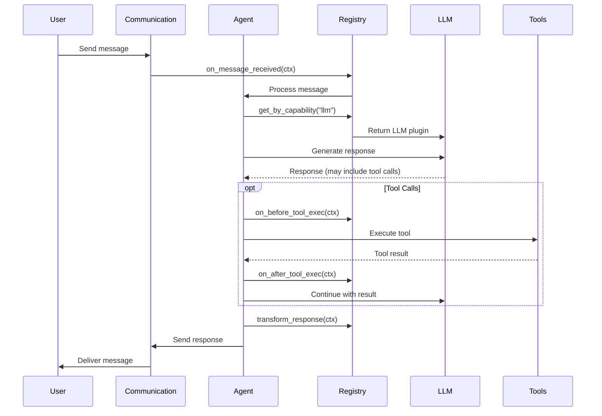
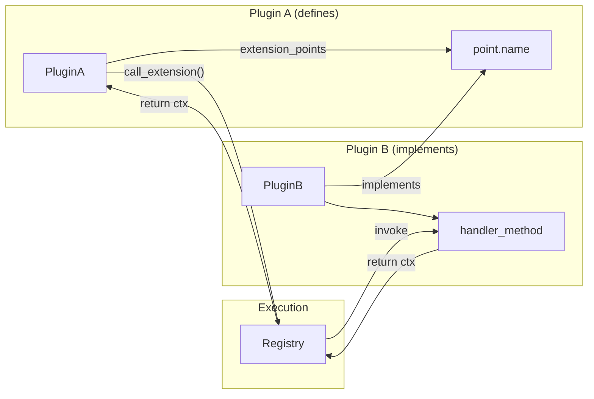
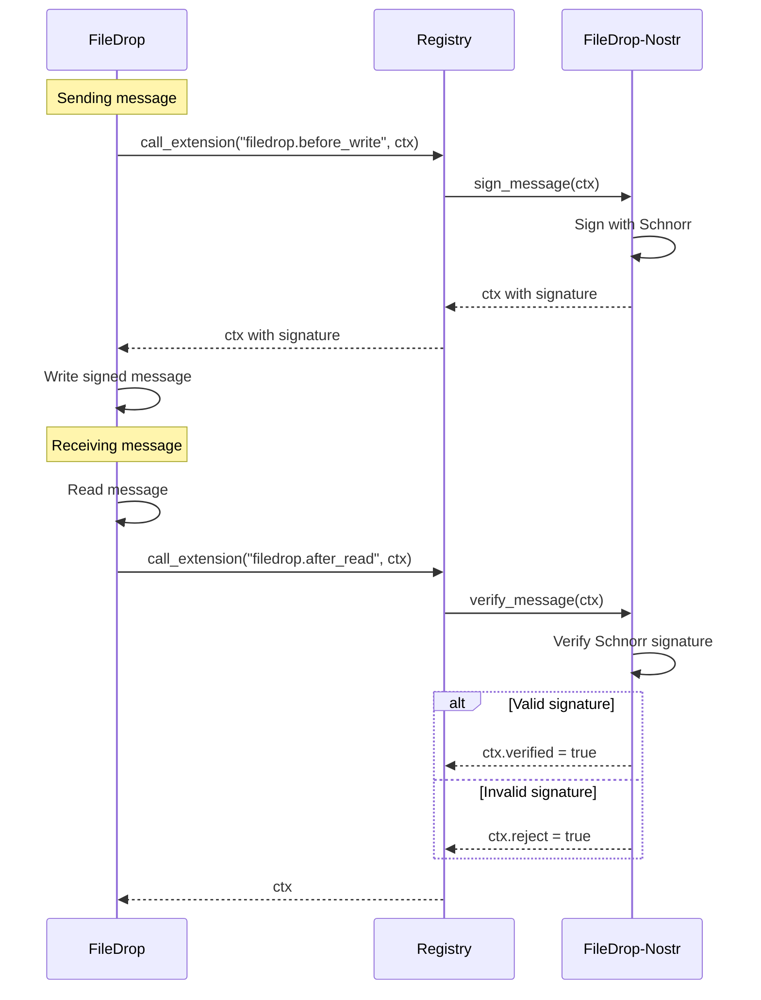
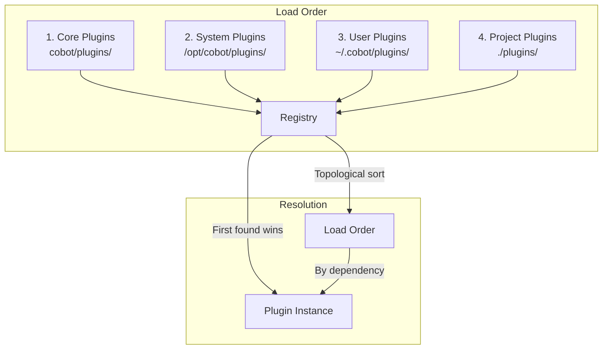
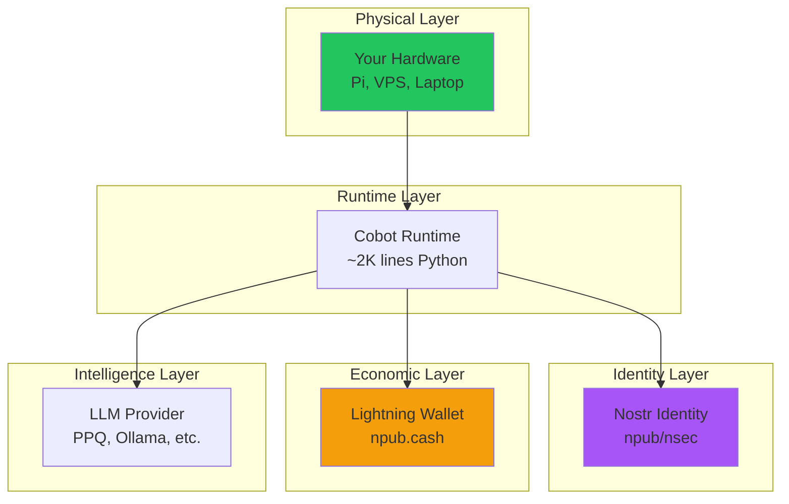
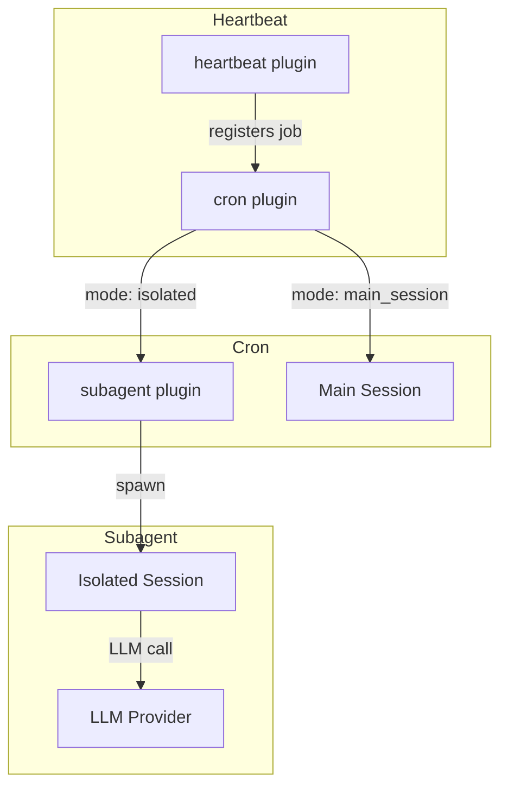

# Cobot Architecture

## Overview



## Plugin Registry

The registry is the heart of Cobot's plugin system.



## Message Flow



## Extension Points

Extension points allow plugins to define hooks that other plugins can implement.



### Example: FileDrop Signing



## Hook Chain

Plugins can intercept lifecycle events via hooks.


## Plugin Loading

Plugins are loaded from multiple paths in order:



## Sovereignty Stack



## Scheduled Execution

Cobot supports scheduled and delegated execution through three composable plugins:



### Subagent Plugin

Spawns isolated sessions for delegated work:
- No conversation history or memory context
- Tool: `spawn_subagent` for agent use
- API: `SubagentProvider.spawn()` for plugin use
- Extension points: `subagent.before_spawn`, `subagent.after_spawn`

### Cron Plugin

Schedules jobs with two execution modes:
- `isolated`: Spawns subagent (no context)
- `main_session`: Injects into main session (full context)
- Extension points: `cron.before_job`, `cron.after_job`

### Heartbeat Plugin

Convenience wrapper for periodic main session wake-up:
- Reads `HEARTBEAT.md` for instructions
- Uses cron internally with `mode: main_session`
- Supports quiet hours

```yaml
# Example configuration
subagent:
  max_concurrent: 3

cron:
  jobs:
    - name: daily-report
      schedule: "0 9 * * *"
      mode: isolated
      prompt: "Generate daily summary"

heartbeat:
  enabled: true
  interval_minutes: 15
  quiet_hours: "23:00-07:00"
```

## Directory Structure

```
cobot/
├── cobot/
│   ├── __init__.py
│   ├── agent.py          # Core agent loop
│   ├── cli.py            # CLI commands
│   └── plugins/
│       ├── __init__.py   # Plugin discovery
│       ├── base.py       # Plugin base class
│       ├── registry.py   # Plugin registry
│       ├── interfaces.py # Capability interfaces
│       ├── config/       # Configuration plugin
│       ├── ppq/          # PPQ LLM provider
│       ├── ollama/       # Ollama LLM provider
│       ├── nostr/        # Nostr communication
│       ├── filedrop/     # FileDrop communication
│       ├── wallet/       # Lightning wallet
│       ├── tools/        # Shell/file tools
│       ├── security/     # Prompt injection shield
│       ├── persistence/  # Conversation memory
│       ├── compaction/   # Context management
│       ├── logger/       # Logging
│       ├── knowledge/    # Local vector search
│       ├── subagent/     # Isolated session spawning
│       ├── cron/         # Scheduled job execution
│       └── heartbeat/    # Periodic main session wake-up
├── tests/                # Test suite
├── docs/                 # Documentation
├── cobot.yml.example     # Example config
├── SOUL.md.example       # Example system prompt
└── pyproject.toml        # Package config
```
